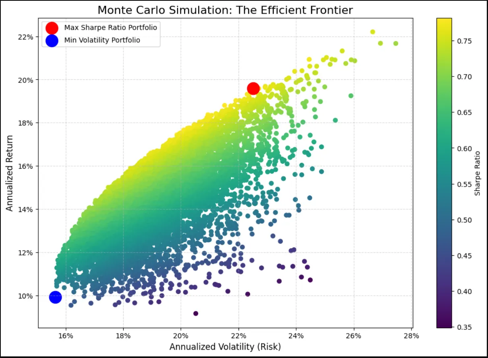

# 📈 Risk-Adjusted Return Analysis: Monte Carlo Study of Portfolio Efficiency

     

📖 **Full write-up:** [Read on Medium](https://medium.com/@krupalpatel3972)

---

## 📋 Project Overview

A comprehensive quantitative finance project covering the **full data lifecycle** — from raw market data acquisition to portfolio optimization via Monte Carlo simulation.

**Core question:** *"How should a diversified investor allocate capital across assets to maximize return while being fairly compensated for the risk they take?"*

This project simulates **10,000 random asset allocations** across 5 stocks using 25 years of historical data, constructs the **Efficient Frontier**, and identifies the two optimal portfolios: one maximizing risk-adjusted returns (Sharpe Ratio) and one minimizing volatility.

---

## 🛠️ Tools & Technologies

| Tool | Purpose |
|---|---|
| Python 3.9+ | Core programming language |
| yfinance | Historical stock data acquisition (Yahoo Finance API) |
| Pandas | Data manipulation and cleaning |
| NumPy | Matrix operations, covariance, simulation math |
| SQLite3 | Storing cleaned log returns in a local database |
| Matplotlib | Efficient Frontier visualization |

---

## 📦 Installation

```bash
# Clone the repository
git clone https://github.com/krupalpatel3972/monte-carlo-portfolio-analysis.git
cd monte-carlo-portfolio-analysis

# Install dependencies
pip install -r requirements.txt

# Run the analysis
python portfolio_analysis.py
```

---

## 🗂️ Repository Structure

```
monte-carlo-portfolio-analysis/
│
├── portfolio_analysis.py     ← Full pipeline: data → SQL → simulation → plot
├── requirements.txt          ← Python dependencies
├── README.md                 ← Project overview (you are here)
└── visualizations/
    └── efficient_frontier.png  ← Output chart (generated on run)
```

---

## 📊 Methodology

### Step 1 — Data Acquisition
Downloaded **25 years** of adjusted closing prices (2000–2025) for 5 diversified stocks using `yfinance`:

| Ticker | Company | Sector |
|---|---|---|
| MSFT | Microsoft Corp | Technology |
| JNJ | Johnson & Johnson | Healthcare |
| CVX | Chevron Corp | Energy |
| WMT | Walmart Inc | Consumer Staples |
| MA | Mastercard Inc | Financial Services |

### Step 2 — Log Returns & SQL Storage
- Calculated **daily log returns**: `ln(Price_t / Price_{t-1})`
- Dropped NaN rows from the first trading day
- Stored cleaned log returns in a **SQLite database** (`portfolio_project.db`) for reproducibility and auditability

### Step 3 — Monte Carlo Simulation (10,000 Portfolios)
For each of 10,000 iterations:
1. Generated random asset weights summing to 1.0
2. Calculated **annualized portfolio return** (mean log return × 252 trading days)
3. Calculated **annualized volatility** using the covariance matrix
4. Computed **Sharpe Ratio** = (Return − Risk-Free Rate) / Volatility
   - Risk-free rate: 2% (US Treasury benchmark)

### Step 4 — Efficient Frontier & Optimal Portfolios
Identified two key portfolios from the simulation results:
- **Max Sharpe Ratio** — best risk-adjusted return (aggressive/balanced investor)
- **Min Volatility** — lowest risk regardless of return (conservative investor)

---

## 📈 Results

### Efficient Frontier Visualization



> Any portfolio below the Efficient Frontier curve is **inefficient** — a better allocation exists that achieves either higher return for the same risk, or lower risk for the same return.

---

### A. Maximum Sharpe Ratio Portfolio
*Best for: Aggressive or balanced investor seeking highest risk-adjusted return*

| Metric | Value |
|---|---|
| Annualized Return | 19.60% |
| Annualized Volatility | 22.12% |
| Sharpe Ratio | 0.7817 |

**Optimal Asset Weights:**

| Ticker | Weight |
|---|---|
| MSFT — Microsoft | 21.40% |
| JNJ — Johnson & Johnson | 4.18% |
| CVX — Chevron | 0.79% |
| WMT — Walmart | 24.25% |
| MA — Mastercard | **49.38%** |

> Mastercard dominates the aggressive portfolio at ~49%, reflecting its superior risk-adjusted historical returns driven by the global shift to digital payments.

---

### B. Minimum Volatility Portfolio
*Best for: Conservative investor prioritizing capital preservation*

| Metric | Value |
|---|---|
| Annualized Return | 9.91% |
| Annualized Volatility | **15.64%** |
| Sharpe Ratio | 0.5069 |

**Optimal Asset Weights:**

| Ticker | Weight |
|---|---|
| MSFT — Microsoft | 2.05% |
| JNJ — Johnson & Johnson | **62.68%** |
| CVX — Chevron | 6.90% |
| WMT — Walmart | 27.97% |
| MA — Mastercard | 0.41% |

> Johnson & Johnson dominates the conservative portfolio at ~63%, reflecting its defensive characteristics as a healthcare blue-chip with low beta and consistent dividends.

---

## 💡 Key Insights

| # | Insight |
|---|---|
| 1 | Mastercard (MA) drives maximum return — high growth, strong moat in digital payments |
| 2 | J&J (JNJ) anchors minimum risk — healthcare defensiveness reduces portfolio volatility significantly |
| 3 | CVX (Chevron) has minimal weight in both optimal portfolios — high volatility, lower Sharpe |
| 4 | Walmart and Microsoft serve as **balancers** — contributing to both portfolios at meaningful weights |
| 5 | The gap between Min Vol return (9.91%) and Max Sharpe return (19.60%) illustrates the **risk-return tradeoff** quantitatively |

---

## 🔬 Limitations & Next Steps

**Current limitations:**
- Monte Carlo uses random sampling — results vary slightly each run (set `np.random.seed()` for reproducibility)
- Historical returns do not guarantee future performance
- Assumes log-normal return distribution — fat tails not captured

**Planned enhancements:**
- **Hierarchical Risk Parity (HRP)** — more robust to estimation error than mean-variance
- **Value-at-Risk (VaR) & Conditional VaR (CVaR)** — tail risk quantification
- **Stochastic Volatility modeling** — GARCH models for time-varying risk
- **Backtesting engine** — test optimal weights against out-of-sample data

---

## 👤 About

**Krupal Patel** — IT Graduate | Financial Data Analyst | Python · SQL · Quantitative Finance  
📍 Waterloo, Ontario, Canada  
🔗 [LinkedIn](https://www.linkedin.com/in/krupal-patel-099462207) | 📖 [Medium](https://medium.com/@krupalpatel3972)
